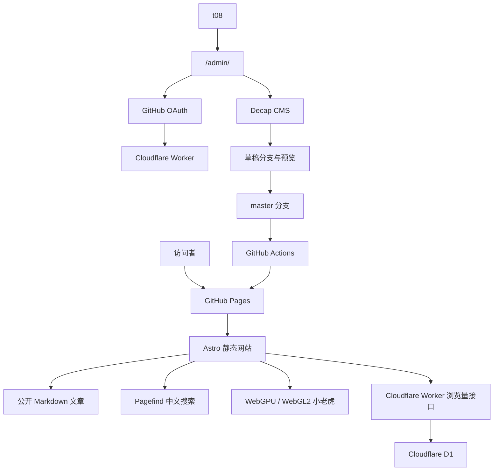

# “深度思考”网站现代化改造技术方案

## 1. 文档信息

- 项目目录：`D:\个人随笔\t0819941558.github.io`
- GitHub 仓库：`t0819941558/t0819941558.github.io`
- 生产分支：`master`
- 网站名称：深度思考
- 作者：t08
- 当前状态：Hexo 4.2.1 + NexT 5.1.4 生成后的静态文件，仓库中没有原始 Markdown 与 Hexo 配置
- 现有内容：31 篇 2020 年文章，以及旧版背景动效和 Live2D 猫咪资源
- 本文状态：实施基线；如后续需求变化，应先更新本文再修改实现

## 2. 已确认需求

1. 保留现有 GitHub Pages 地址 `https://t0819941558.github.io/`。
2. 后续代码和内容直接使用 `master` 分支，不迁移到 `main`。
3. 新站使用现代化响应式设计，品牌为“深度思考”，作者显示为 `t08`。
4. 新文章以 Markdown 保存并公开阅读。
5. 通过 `/admin/` 后台创建、编辑和发布 Markdown 文章。
6. 后台仅允许 GitHub 用户 `t0819941558` 登录。
7. 文章正式发布后自动更新 GitHub 仓库，并触发 GitHub Pages 自动部署。
8. 发布采用“草稿 → 预览 → 确认上线”的流程。
9. Word、PDF 等文件不转换为文章，只作为文章附件保存和下载。
10. 31 篇旧文章转换为归档内容，仅保存在仓库中，不生成页面，不进入首页、搜索、RSS 或站点地图。
11. 新站需要文章目录导航、中文全文搜索和公开浏览量。
12. 3D 宠物为卡通小老虎，优先使用 WebGPU 与 TSL，同时保留 WebGL2 回退。
13. 不专门兼容性能较弱或过旧的设备，但网站正文不能因 3D 功能失败而不可用。

## 3. 目标架构



架构原则：

- GitHub 仓库是文章、附件、代码和 3D 资源的主存储。
- GitHub Pages 只托管构建后的静态网站。
- Decap CMS 只提供内容管理界面，不单独保存文章。
- Cloudflare Worker 仅承担 GitHub OAuth 回调和浏览量 API。
- Cloudflare D1 仅保存浏览量，不保存文章正文。
- 3D 场景是渐进增强功能，与正文渲染完全解耦。

## 4. 技术栈

| 范围 | 技术选择 | 用途 |
| --- | --- | --- |
| 网站框架 | Astro 最新稳定版 | 静态页面、路由和内容构建 |
| 开发语言 | TypeScript 严格模式 | 前端、3D 控制器和 Worker |
| 内容系统 | Astro Content Collections + Markdown | 内容建模、校验和类型生成 |
| 管理后台 | Decap CMS | 在线编辑、附件上传、草稿与发布 |
| 后台界面 | React，仅在 `/admin/` 加载 | Decap CMS 运行环境与自定义预览 |
| 3D 渲染 | Three.js `WebGPURenderer` | WebGPU 优先、WebGL2 自动回退 |
| 着色器 | TSL | 背景、轮廓、光照和后处理 |
| 模型格式 | Blender 5.2 源文件 + glTF/GLB | 可编辑源模型与网站运行模型分离 |
| 模型优化 | 同材质静态网格合并、按需加载 | 控制 Draw Call、模型体积和首屏阻塞 |
| 搜索 | Pagefind Extended | 中文静态全文搜索 |
| 浏览量 | Cloudflare Worker + D1 | 去重计数与查询 |
| 登录 | GitHub OAuth + Cloudflare Worker | 仅允许仓库所有者访问后台 |
| 自动发布 | GitHub Actions + GitHub Pages | 校验、构建、索引和部署 |
| 包管理 | pnpm | 依赖安装与锁定 |

所有依赖在实施时使用当时的最新稳定版本，并通过 `pnpm-lock.yaml` 固定实际版本，避免自动升级破坏构建。

## 5. 规划目录

```text
t0819941558.github.io/
├─ src/
│  ├─ components/
│  │  ├─ article/
│  │  │  ├─ ArticleHeader.astro
│  │  │  └─ TableOfContents.astro
│  │  ├─ search/
│  │  │  └─ SearchDialog.astro
│  │  └─ tiger/
│  │     ├─ TigerScene.ts
│  │     ├─ TigerController.ts
│  │     └─ shaders.ts
│  ├─ content/
│  │  ├─ posts/                 # 新文章，会公开构建
│  │  └─ archive/               # 旧文章，只归档不构建
│  ├─ layouts/
│  │  ├─ BaseLayout.astro
│  │  └─ ArticleLayout.astro
│  ├─ pages/
│  │  ├─ index.astro
│  │  ├─ about.astro
│  │  ├─ search.astro
│  │  ├─ admin/index.astro
│  │  └─ posts/[...slug].astro
│  ├─ styles/
│  └─ content.config.ts
├─ public/
│  ├─ admin/config.yml
│  ├─ models/tiger.glb        # Blender 导出的运行模型
│  └─ uploads/
│     ├─ images/
│     └─ attachments/
├─ worker/
│  ├─ src/index.ts
│  ├─ migrations/0001.sql
│  └─ wrangler.jsonc
├─ scripts/
│  ├─ migrate-legacy.mjs
│  └─ optimize-model.mjs
├─ .github/workflows/
│  ├─ validate.yml
│  └─ deploy.yml
├─ astro.config.mjs
├─ package.json
├─ pnpm-lock.yaml
└─ tsconfig.json
```

## 6. 内容模型

新文章使用以下 Front Matter：

```yaml
title: WebGPU 学习笔记
slug: webgpu-notes
description: WebGPU 基础概念与实践记录
publishedAt: 2026-09-29
updatedAt: 2026-09-29
tags:
  - WebGPU
  - 图形学
cover: /uploads/images/webgpu-cover.webp
attachments:
  - name: 参考资料.pdf
    file: /uploads/attachments/webgpu-reference.pdf
draft: false
```

字段规则：

- `title`、`slug`、`description`、`publishedAt`、`draft` 必填。
- `slug` 必须唯一，只允许安全的 URL 字符。
- `updatedAt`、`tags`、`cover`、`attachments` 可选。
- `draft: true` 的文章不生成公开页面，也不进入搜索、RSS 和站点地图。
- 附件允许 PDF、DOCX、XLSX、PPTX、ZIP 和常见图片格式。
- 单个附件默认限制为 20 MB；禁止脚本、可执行文件和危险路径。

## 7. Decap CMS 与发布流程

### 7.1 登录

1. 用户访问 `/admin/`。
2. Decap CMS 打开 GitHub OAuth 登录窗口。
3. Cloudflare Worker 处理 `/auth` 和 `/callback`。
4. Worker 查询 GitHub 用户的稳定数字 ID，并与允许列表比较。
5. 只有 `t0819941558` 对应的 GitHub 用户 ID 能继续使用后台。

GitHub Client Secret、用户 ID 和签名密钥使用 Cloudflare Worker Secret 保存，不写入仓库。

### 7.2 编辑与预览

- Decap collection 指向 `src/content/posts/`。
- 编辑器提供标题、摘要、发布日期、标签、封面、附件和 Markdown 正文。
- 后台预览组件复用生产文章的排版 CSS。
- 图片保存到 `public/uploads/images/`。
- 附件保存到 `public/uploads/attachments/`。
- 文件名进行日期分组、规范化和冲突处理。

### 7.3 草稿与上线

Decap 启用 `editorial_workflow`：

1. 保存草稿时创建 CMS 分支，不修改 `master`。
2. 作者在后台预览文章。
3. 标记为准备发布时创建 Pull Request。
4. 确认发布后合并到 `master`。
5. `master` 更新触发 GitHub Actions。
6. 构建成功后更新 GitHub Pages。

代码开发和最终发布均以 `master` 为生产分支；CMS 临时草稿分支只服务于预览流程。

## 8. 旧文章迁移

迁移脚本处理现有 31 个文章目录：

1. 从每个旧页面提取 `.post-body`。
2. 提取标题、发布时间、分类、标签和原始路径。
3. 将正文 HTML 转换为 Markdown。
4. 重写本地图片引用。
5. 输出到 `src/content/archive/`。
6. 记录原始 URL，便于以后恢复链接。
7. 生成迁移报告，列出无法自动转换的片段。

归档内容不注册公开路由，因此：

- 不出现在首页。
- 不出现在搜索中。
- 不生成 RSS、站点地图或标签页。
- 原有文章地址在新版上线后返回 404。
- 将来需要恢复时，可把单篇文件移到 `posts/` 并补齐公开字段。

迁移前为当前状态创建 Git 标签，完整旧站仍可通过 Git 历史恢复。

## 9. 3D 小老虎设计

### 9.1 模型与动作

采用 Blender 5.2 生成的卡通低多边形小老虎，保留 `.blend` 源文件，并导出带头部、身体、前爪、尾巴与眼睛控制节点的 GLB。网页控制器通过稳定节点名驱动动作。第一版动作集：

- `idle`：呼吸和轻微尾巴摆动
- `blink`：随机眨眼
- `look`：跟随指针转头
- `react`：点击回应
- `sit`：坐下
- `stretch`：伸懒腰
- `sleep`：长时间无操作后睡觉
- `wake`：用户重新交互时醒来
- `jump`：页面切换或特定触发时跳跃

动画由有限状态机管理，禁止互斥动作同时播放，并通过交叉淡化保证过渡自然。

### 9.2 渲染

- 使用 `WebGPURenderer` 优先初始化 WebGPU。
- WebGPU 不可用时由 Three.js 使用 WebGL2 后端。
- 背景和小老虎共用一个透明 Canvas 与渲染器。
- 页面正文保持标准 DOM，3D 层只使用 `pointer-events` 的局部命中区域。
- TSL 用于卡通光照、轮廓、背景粒子与颜色过渡。
- 通过 Raycaster 或等价拾取机制识别头部、身体和尾巴点击。
- 3D 初始化失败时隐藏 Canvas，不影响导航和文章阅读。

### 9.3 性能预算

- 当前 GLB 不使用外部贴图，模型和 3D 运行时代码均在浏览器空闲时异步加载。
- GLB 与主要纹理合计目标不超过 3 MB，模型不超过约 50,000 个三角面。
- 如后续加入纹理，主要纹理使用 KTX2，最高 2048×2048。
- Draw Call 目标不超过 20。
- 现代桌面浏览器目标 60 FPS。
- 文章正文完成首屏渲染后再异步加载 3D。
- 根据设备像素比和实际帧耗动态调整渲染分辨率。
- 页面隐藏时完全暂停渲染循环。
- 角色不可见或处于睡眠状态时降低动画更新频率。
- 使用烘焙或简化接触阴影，不使用高成本级联实时阴影。

## 10. 页面和视觉设计

### 10.1 页面

- `/`：品牌首屏、最新文章列表、搜索入口。
- `/posts/{slug}/`：文章正文、目录、附件和浏览量。
- `/search/`：中文全文搜索。
- `/about/`：作者与网站说明。
- `/admin/`：内容管理后台，不进入搜索索引。
- `/404.html`：统一的未找到页面。

### 10.2 视觉方向

- 主色：深墨蓝或近黑。
- 强调色：虎橙与暖金。
- 文字：优先系统中文字体，正文保持较宽行距和适中行宽。
- 背景：低密度 TSL 粒子或流动线条。
- 小老虎默认位于右下角，并限制活动范围，避免遮挡正文。
- 阅读页降低背景亮度与动效密度。
- 支持深浅主题与手动暂停动画。
- 即使不专门兼容弱设备，仍尊重系统的 `prefers-reduced-motion` 设置。

## 11. 目录导航与搜索

### 11.1 目录导航

- 构建时提取 H2 和 H3。
- 桌面端使用右侧吸附目录。
- 窄屏使用折叠目录。
- 使用 Intersection Observer 高亮当前章节。
- 标题生成稳定锚点，支持复制和分享章节链接。

### 11.2 中文搜索

- 构建结束后运行 Pagefind Extended。
- 仅索引已发布的 `posts` 集合。
- 索引标题、摘要、标签与正文。
- 不索引归档、后台、附件和草稿。
- 搜索完全在浏览器运行，不向第三方发送查询词。

## 12. 浏览量服务

Worker 提供：

```text
GET  /api/views/{slug}
POST /api/views/{slug}
```

D1 基础表：

```sql
CREATE TABLE page_views (
  slug TEXT PRIMARY KEY,
  total INTEGER NOT NULL DEFAULT 0,
  updated_at TEXT NOT NULL
);

CREATE TABLE daily_visitors (
  slug TEXT NOT NULL,
  visitor_hash TEXT NOT NULL,
  view_date TEXT NOT NULL,
  PRIMARY KEY (slug, visitor_hash, view_date)
);
```

计数规则：

- 页面处于可见状态并停留达到阈值后才发送计数请求。
- 同一访问者、同一文章、同一天只增加一次。
- Worker 使用每日轮换密钥散列 IP 和 User-Agent，不保存原始 IP。
- 定期清理过期的 `daily_visitors` 记录。
- 只允许生产域名和本地开发域名跨域访问。
- 浏览量服务失败时隐藏数字，不阻塞文章渲染。

## 13. Cloudflare 资源

需要创建一个 Cloudflare 免费账号：

- 注册入口：<https://dash.cloudflare.com/sign-up>
- Worker 计划名称：`deep-thought-api`
- D1 数据库计划名称：`deep-thought-views`

首次部署后，Cloudflare 会提供类似地址：

```text
https://deep-thought-api.<account-subdomain>.workers.dev
```

GitHub OAuth App 在 <https://github.com/settings/developers> 创建，回调地址设置为：

```text
https://deep-thought-api.<account-subdomain>.workers.dev/callback
```

在 Cloudflare 资源创建前，网站主体、3D、搜索、CMS 本地模式和 GitHub Actions 均可先完成；在线 CMS 登录与真实浏览量需要上述资源。

## 14. 安全设计

- OAuth 使用随机 `state` 并校验回调来源。
- 后台按 GitHub 稳定用户 ID 授权，不只依赖用户名。
- OAuth Secret、散列密钥只保存在 Worker Secret。
- Worker CORS 允许列表只包含生产域名和本地开发地址。
- D1 全部使用参数化查询。
- Markdown 渲染前清理危险 HTML 和协议。
- 上传文件校验扩展名、MIME、大小和最终路径。
- 管理后台设置 `noindex`。
- GitHub Actions 使用最小权限：构建任务只读内容，部署任务仅写 Pages。
- 依赖通过锁文件固定，并定期进行审计更新。

## 15. GitHub Actions

### 15.1 验证工作流

对 Pull Request 和 `master` 更新运行：

1. 安装锁定依赖。
2. 校验 Markdown schema。
3. 执行 TypeScript 类型检查。
4. 构建 Astro。
5. 生成 Pagefind 索引。
6. 检查主要内部链接和附件路径。
7. 执行必要的 Worker 单元测试和页面冒烟测试。

### 15.2 部署工作流

只对 `master` 的成功构建执行：

1. 构建生产站点。
2. 上传 Pages artifact。
3. 使用 GitHub Pages 官方 Actions 部署。
4. 通过 concurrency 取消过时部署，避免旧提交覆盖新提交。

构建失败不会替换当前线上版本。需要回退时，对 `master` 中对应提交执行 `git revert`，由同一工作流重新部署。

## 16. 分阶段实施

### 阶段 A：保护与迁移

- 创建旧站 Git 标签。
- 生成 31 篇文章清单。
- 开发并运行迁移脚本。
- 校验标题、日期、正文和图片。
- 输出迁移报告。

### 阶段 B：网站骨架

- 初始化 Astro、TypeScript 和 pnpm。
- 建立内容 schema、页面、布局和视觉变量。
- 完成首页、文章页、关于页和 404。

### 阶段 C：阅读能力

- 完成 Markdown 渲染、代码高亮和附件。
- 完成目录导航。
- 完成 Pagefind 中文搜索。
- 添加 RSS、站点地图、Open Graph 和 canonical 元数据。

### 阶段 D：3D 体验

- 完成小老虎模型和动画。
- 接入 WebGPU/TSL 与 WebGL2 回退。
- 完成交互状态机、背景和性能控制。
- 验证 3D 失败时的降级行为。

### 阶段 E：内容后台

- 接入 Decap CMS。
- 建立文章字段、上传规则和生产样式预览。
- 验证草稿、Pull Request 和发布流程。

### 阶段 F：动态服务与上线

- 创建 Cloudflare Worker 和 D1。
- 配置 GitHub OAuth。
- 完成浏览量 API。
- 配置 GitHub Actions 与 Pages。
- 完成上线检查和回退验证。

## 17. 验收标准

### 内容与后台

- `/admin/` 仅允许 `t0819941558` 登录。
- 可以新建或导入 Markdown。
- 可以上传图片和附件。
- 草稿不出现在公网。
- 后台预览与正式文章排版一致。
- 发布后 `master` 出现对应提交并自动部署。

### 前台

- 首页只展示新文章。
- 旧文章不生成路由，也不进入搜索。
- 中文搜索能命中标题、标签和正文。
- 文章目录能正确跟随阅读位置。
- 浏览量能显示且按日去重。
- 附件可以正常下载。

### 3D

- 支持 WebGPU 的浏览器使用 WebGPU。
- 其他现代浏览器自动回退 WebGL2。
- 小老虎具备待机、观察、点击、睡眠和唤醒交互。
- 页面切换后不会重复创建渲染器或泄漏资源。
- 3D 资源加载失败时，正文和导航仍正常。

### 工程与发布

- `master` 是唯一生产分支。
- Pull Request 与 `master` 均执行完整校验。
- 构建失败不覆盖当前线上版本。
- 可以通过 Git revert 恢复上一版本。
- 仓库中不包含 OAuth Secret 或其他敏感信息。

## 18. 主要风险与处理

| 风险 | 处理方式 |
| --- | --- |
| 旧 HTML 转 Markdown 存在格式损失 | 生成迁移报告，并对包含表格、代码和图片的文章重点检查 |
| WebGPURenderer 仍在快速演进 | 锁定版本、保留 WebGL2 回退、隔离 3D 层 |
| 3D 模型过大影响首屏 | 延迟加载、Meshopt、KTX2、资源预算和缓存 |
| GitHub OAuth 权限范围较大 | 最小 scope、用户 ID 白名单、Worker 中保管 Secret |
| D1 或 Worker 暂时不可用 | 浏览量静默降级，不影响内容阅读 |
| 附件导致仓库膨胀 | 单文件限制；容量增长后迁移到 R2，Markdown 链接保持不变 |
| CMS 预览与生产样式偏差 | 后台预览复用同一套排版变量和组件样式 |

## 19. 外部文档

- Astro GitHub Pages：<https://docs.astro.build/en/guides/deploy/github/>
- Astro Content Collections：<https://docs.astro.build/en/guides/content-collections/>
- Decap CMS：<https://decapcms.org/docs/intro/>
- Decap GitHub Backend：<https://decapcms.org/docs/github-backend/>
- Decap Editorial Workflow：<https://decapcms.org/docs/editorial-workflows/>
- Three.js WebGPURenderer：<https://threejs.org/manual/pages/webgpurenderer>
- Three.js TSL：<https://threejs.org/tsl/>
- Pagefind：<https://pagefind.app/docs/>
- Cloudflare Workers：<https://developers.cloudflare.com/workers/>
- Cloudflare D1：<https://developers.cloudflare.com/d1/>
- GitHub OAuth App：<https://docs.github.com/en/apps/oauth-apps/building-oauth-apps/creating-an-oauth-app>
- GitHub Pages Actions：<https://docs.github.com/en/pages/getting-started-with-github-pages/using-custom-workflows-with-github-pages>
